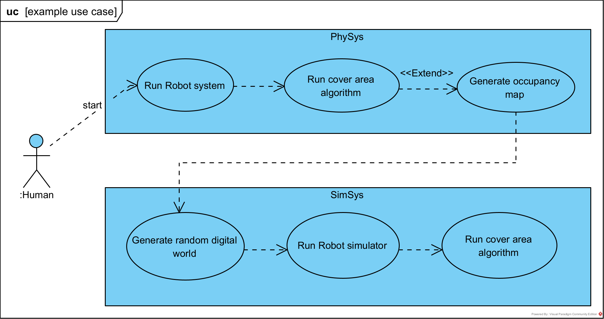
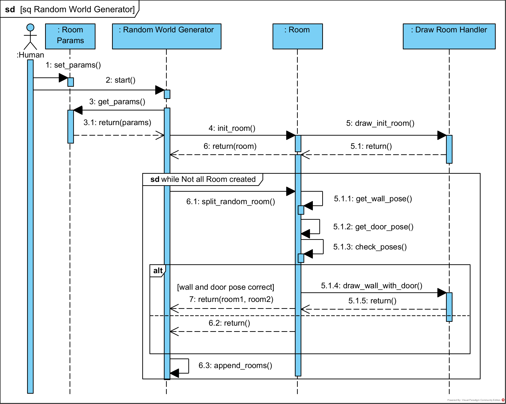

# Simulation system for the development of autonomous vacuum cleaner navigation
ROS 2 - based project implementing simple covering area with turtlebot3 as vacuum cleaner.

Simulation system for autonomous mobile robot navigation evaluation, which enables to create dynamic simulation environment with random rooms and emerging obstacles. System is described in Domain Specification Language SPSysML ([https://arxiv.org/abs/2303.09565](https://arxiv.org/abs/2303.09565)) , which rates system simulation-physical integrality. The thesis proposes indicators used to examinate navigation algorithms. The work is a proposal of a standard for quality indicators used when evaluating navigation algorithms of mobile robots

## Installation

ROS 2 Foxy
https://docs.ros.org/en/foxy/Installation.html


TurtleBot3 https://emanual.robotis.com/docs/en/platform/turtlebot3/quick-start/

Install dependencies
```console
pip3 install meshlib
pip3 install aspose-words
```

Clone project
```console
cd ~/vc_ws/src
ros2 pkg create --build-type ament_cmake vacuum_cleaner_pkg
sudo rm -r vacuum_cleaner_pkg
git clone https://github.com/MaciejGroszyk/vacuum_cleaner_pkg.git
cd ..
colcon build
```

## Run
```console
cd vc_ws/ && source ~/ros2_foxy/install/setup.bash && source ~/turtlebot3_ws/install/setup.bash && source install/setup.bash

export TURTLEBOT3_MODEL=waffle && ros2 launch turtlebot3_gazebo empty_world.launch.py
```
Manualy spawn map from /home/user/.gazebo/models and drop robot to map frames and run algorithm.

```console
-- random walk
ros2 run vacuum_cleaner_pkg main_node random
-- spiral walk
ros2 run vacuum_cleaner_pkg main_node spiral
-- snaking walk
ros2 run vacuum_cleaner_pkg main_node snaking
```


Generate world with command
```console
~/vc_ws/src/vacuum_cleaner_pkg/scripts
-- generate model 3D
pip3 worldMapModelGenerator.py
-- generate model 2D
pip3 worldMapPngGenerator.py
-- spawn obstacles
pip3 gazeboRandomSpawnModel.py
```


## Requirement specification
 
 



## Project structure


## World synchronization


Flow diagram


Load visualization


Load visualization example


Generating the real world to simulation


Generating the real world to simulation example

 
 
 

Generate random visualization

 



Generate random visualization example
 


Spawninng obstacles
 


## DT/PT decomposition – Mirroring Agent Groups specification

Simulation agent


Physical agent


## Agent decomposition
Simulation agent decomposition


Physical agent decomposition


## Structure evaluation

**Controller integrity factor** IFF = 1. The higher the IIF value, the more software components are shared between the simulation and physical embodiments. Maximum IIF value is 1 - all abstract hardware parts of the system are common.

**Driver generalisation factor** DGF = 1. The higher the value, the easier it is to integrate physical and simulated hardware in the future.

**Digital Twin coverage** DTC = 1. All physical parts have digital twins.

**Mirror integrity factor** MIF<sub>Robot</sub> = 1. Parts of the system between the physical and digital twins that make up the robot are shared.